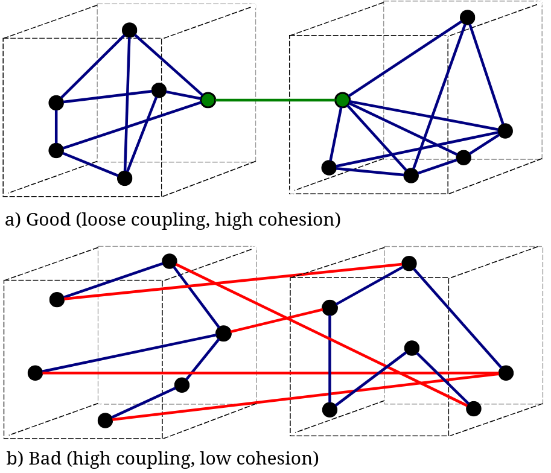
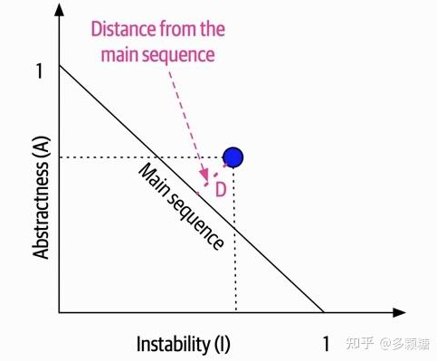

- Coupling refers to the degree of independence between two modules.
	- High Coupling = Bad (Modules are closely connected and changing one module will have effect on the other module.)
	- Low Coupling = Good (Changing one module will have little impact on the other module)
	- 
- Metrics of coupling that has value for an architect
	- 1979, Edward Yourdon and Larry Constantine's Structured Design
	- Afferent Coupling
		- Number of incoming connection to a code artifact (component, class, function etc.)
	- Efferent Coupling
		- Number of outgoing connection to other code artifacts (components, class, function etc.)
- Metrics of Coupling for a deeper evaluation
	- Abstractness #card
	  id:: 677d5204-2f76-4fc1-b098-9b5bf352277f
	  card-last-interval:: 4
	  card-repeats:: 1
	  card-ease-factor:: 2.6
	  card-next-schedule:: 2025-01-12T04:50:13.774Z
	  card-last-reviewed:: 2025-01-08T04:50:13.775Z
	  card-last-score:: 5
		- Ratio of abstract artifacts (abstract class, interface) and concrete artifacts (implementing classes).
		- Balance must be maintained between abstractness and concreteness.
		- Too much abstraction can lead to confusion of how parts are coming together to do a particular job.
		- $$A = \frac{\sum{m^{a}}}{\sum{m^{c}}}$$
		- Here, **m^{a}** = abstract artifacts & **m^{c}** = concrete artifacts
	- Instability #card
	  id:: 677d5387-8eb9-4d43-8b45-01fa6c5f70b3
	  card-last-interval:: 4
	  card-repeats:: 1
	  card-ease-factor:: 2.6
	  card-next-schedule:: 2025-01-12T04:50:31.041Z
	  card-last-reviewed:: 2025-01-08T04:50:31.042Z
	  card-last-score:: 5
		- It is a derived metric from Afferent and Efferent coupling.
		- Ratio of Efferent coupling and the sum of both Efferent (outgoing) and Afferent (incoming) coupling.
		- $$I = \frac{C^{e}}{C^{a} + C^{e}}$$
		- Determines volatility of a code base.
		- High Instability = Bad (Breaks more easily cause of High Coupling).
		- QUESTION Is more outgoing link causes high cohesion than more incoming link?
	- Distance From The Main Sequence #card
	  id:: 677d5e7b-9c62-4dbd-8c80-c8ef273b492c
	  card-last-interval:: 4
	  card-repeats:: 1
	  card-ease-factor:: 2.6
	  card-next-schedule:: 2025-01-12T04:54:54.545Z
	  card-last-reviewed:: 2025-01-08T04:54:54.546Z
	  card-last-score:: 5
		- Derived metrics from Abstractness(A) and Instability(I)
		- $$D = |A + I - 1|$$
		- 
		- Upper-righthand side = zone of uselessness (code with too much abstraction)
		- Lower-lefhand side = zone of pain (code with too much implementation)